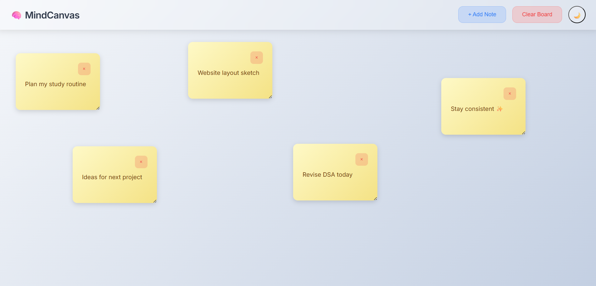
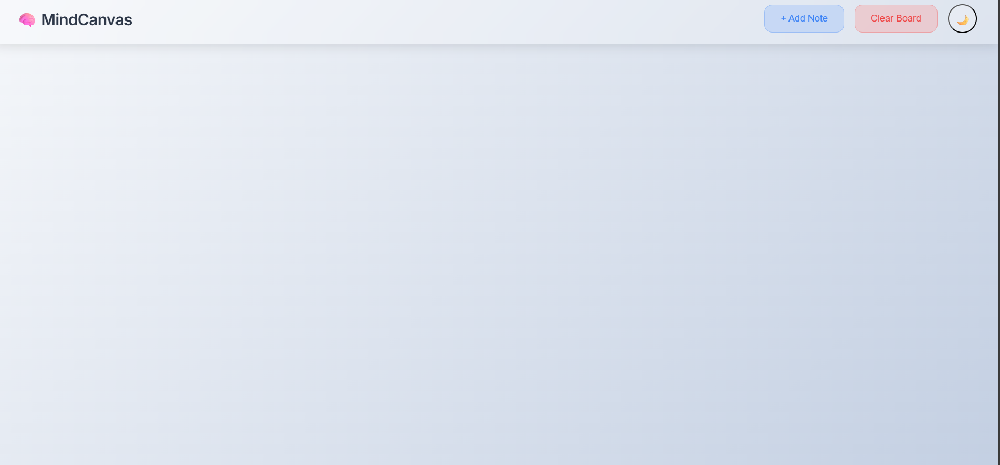
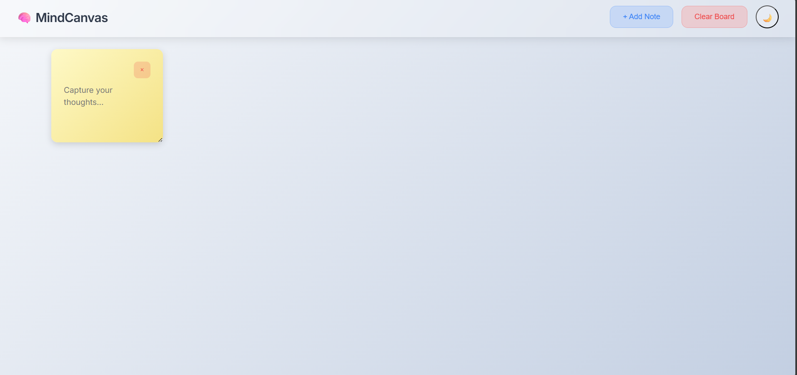
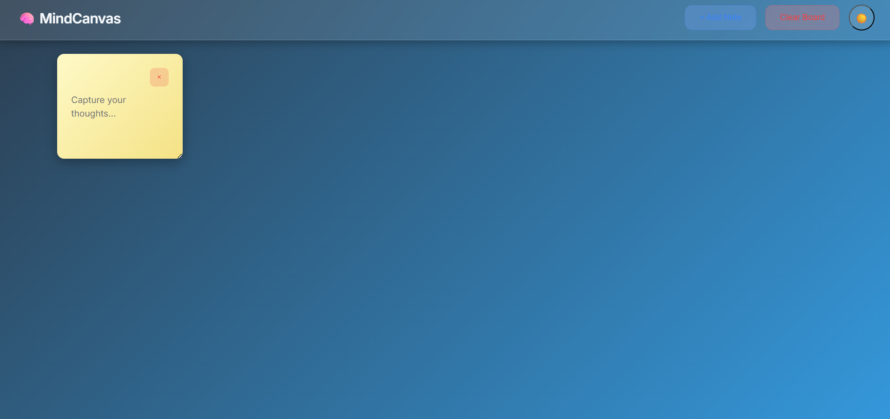

🧠 MindCanvas — Thought Organizer

MindCanvas is a clean, beautiful, and responsive sticky-notes app designed to organize your thoughts, ideas, and tasks visually.
Featuring drag-and-drop notes, color themes, auto-save, dark mode, and a minimal productivity-focused UI — perfect for students, creators, and planners.

🌐 Live Demo

🔗 https://deepali-kumari-iitp.github.io/MindCanvas/

🖼️ Screenshots
📌 Board View

📌 Empty Board

📌 Single Note Example

📌 Dark Mode View

✨ Features

📝 Sticky Notes System

Add unlimited notes

Drag, drop, and reposition anywhere

Resizable notes

Smooth animations & clean UI

🎨 Color-Coded Notes

Pastel yellow notes (can add more colors in future)

Easy to categorize thoughts

⌛ Auto-Save (LocalStorage)

Notes are saved automatically

Retains:
✔ Text
✔ Position
✔ Size
✔ Theme

Data stays even after closing the browser

🌗 Dark / Light Theme

Beautiful gradient-based themes

One toggle icon switches the theme

Smooth transition

📱 Fully Responsive

Works perfectly on:
✔ Mobile
✔ Tablets
✔ Desktop

Touch-friendly drag and tap interactions

🧹 Clear Board

One-click board reset

Confirmation message (optional in future)

🛠️ Tech Stack

HTML5

CSS3 (Glassmorphism + gradients)

JavaScript (Vanilla JS)

LocalStorage

📁 Folder Structure

mindcanvas/
│
├── asset
│   └── screenshots
│       ├── board-view.png
│       ├── dark-mode-view.png
│       ├── empty-board.png
│       └── single-note.png
│
├── css
│   └── style.css
│
├── js
│   └── main.js
│
└── index.html

🚀 How to Run Locally

git clone git@github.com:deepali-kumari-iitp/mindcanvas-thought-organizer.git
cd mindcanvas-thought-organizer
open index.html
Or simply open the index.html file in your browser.

🔮 Future Enhancements

Here are the planned improvements to make MindCanvas even better:

🟦 Add Multiple Note Colors

Pink, Blue, Mint, Lavender, Peach, etc.

🔍 Search Notes

Filter notes by keywords.

🧩 Categories / Tags

Group notes by category.

📄 Export Notes

Download notes as:

PDF

PNG

JSON

🔔 Reminders

Set reminders for specific notes.

📌 Pin Notes

Pin important notes to stay on top.

✏️ Custom Fonts

Choose between multiple handwriting fonts.

👩‍💻 Author

Deepali Kumari (IIT Patna)
Passionate Web Developer • UI/UX Lover • Building beautiful productivity apps

⭐ If you like this project, please star the repo!

It motivates me to build more beautiful tools like this 🌸
